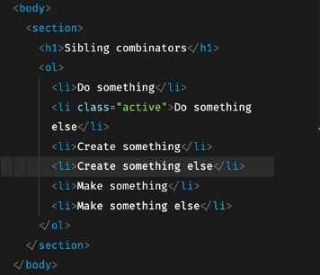

# 구조적 가상 클래스 선택자 (Structural Pseudo-classes)

요소들 중 첫번째, 마지막, n번째 요소에 스타일 적용 할 때 사용
<br>

> 가상 클래스 선택자 : 어떠한 상태나 조건을 만족할 때 사용 가능한 선택자



### 첫 번째 요소 (element:first-child)

```
li:first-child{ 스타일 } //첫 번째 li태그에 스타일 적용
```

<br>

### 마지막 요소 (element:last-child)

```
li:last-child{ 스타일 } //마지막 li태그에 스타일 적용
```

<br>

### n 번째 요소 (element:nth-child(n))

```
li:nth-child(n){ 스타일 } //n 번째 li태그에 스타일 적용

li:nth-child(2n){ 스타일 } // 짝수(2n) 번째 li 태그에 스타일 적용

li:nth-child(2n-1){ 스타일 } // 홀수(2n-1) 번째 li 태그에 스타일 적용
```
