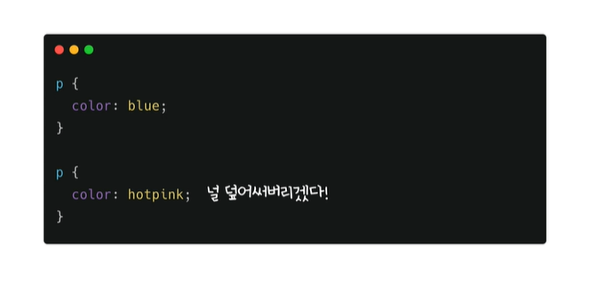
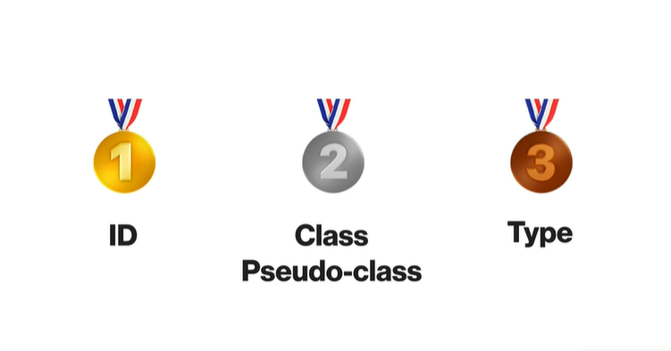
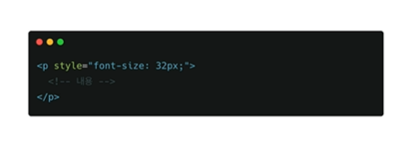

# 선택자 우선순위

보통 CSS는 나중에 선언 된 것이 적용된다. 하지만 선택자 우선순위에 따라 순서와 상관없이 적용될 스타일이 정해질 수 있다.

 

### 선택자 우선순위

선택자 우선 순위는 사진과 같이 ID(아이디) > Class(클래스) > Type(요소) 순이다.
올림픽에서 금메달이 1개인 나라가 은메달이 10개인 나라보다 종합 순위가 높은것 처럼 CSS에서 아무리 많은 클래스로 적용된 스타일 보다 ID 선택자 1개가 우선순위가 더 높다.

 

하지만 이러한 선택자 우선순위를 무시하는 것들이 있다.

#### Inline Style

html 태그에서 요소에 직접 스타일을 적용하는 방법

#### !important

다음과 같이 스타일에 !important를 입력하면 Inline Style보다도 높은 우선순위를 갖는다.

 

🛑Inline Style 과 !important 는 가급적 사용하지 않는것이 좋다!!🛑
